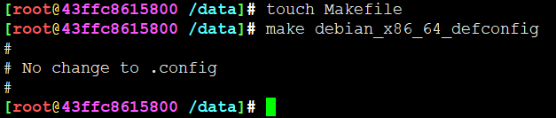

# 编译错误告警汇总

## has modification time 22480 s in the future

```
[root@43ffc8615800 /data]# make debian_x86_64_defconfig
make: Warning: File 'arch/x86/Makefile' has modification time 22455 s in the future
make[1]: Warning: File 'scripts/Makefile.host' has modification time 22480 s in the future
  HOSTCC  scripts/basic/fixdep
make[1]: warning:  Clock skew detected.  Your build may be incomplete.
make[1]: Warning: File 'scripts/Makefile.host' has modification time 22479 s in the future
  HOSTCC  scripts/kconfig/conf.o
  HOSTCC  scripts/kconfig/confdata.o
  HOSTCC  scripts/kconfig/expr.o
  LEX     scripts/kconfig/lexer.lex.c
  YACC    scripts/kconfig/parser.tab.[ch]
  HOSTCC  scripts/kconfig/lexer.lex.o
  HOSTCC  scripts/kconfig/menu.o
  HOSTCC  scripts/kconfig/parser.tab.o
  HOSTCC  scripts/kconfig/preprocess.o
  HOSTCC  scripts/kconfig/symbol.o
  HOSTCC  scripts/kconfig/util.o
  HOSTLD  scripts/kconfig/conf
#
# configuration written to .config
#
make[1]: warning:  Clock skew detected.  Your build may be incomplete.
make: warning:  Clock skew detected.  Your build may be incomplete.
```

Makefile根据时间戳判定文件新旧程度，这里应该是文件时间超前当前系统时间，难道文件来自未来？

解决办法就是把告警的文件都touch一下就好了，摸一下，更新时间戳。




apt-get install -y --force-yes vim gcc build-essential make \
		libncurses-dev \
		apt-file \
		xfsprogs \
		file git flex bison \
		bc libelf-dev libssl-dev


---
